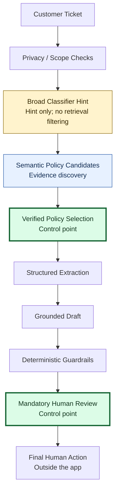
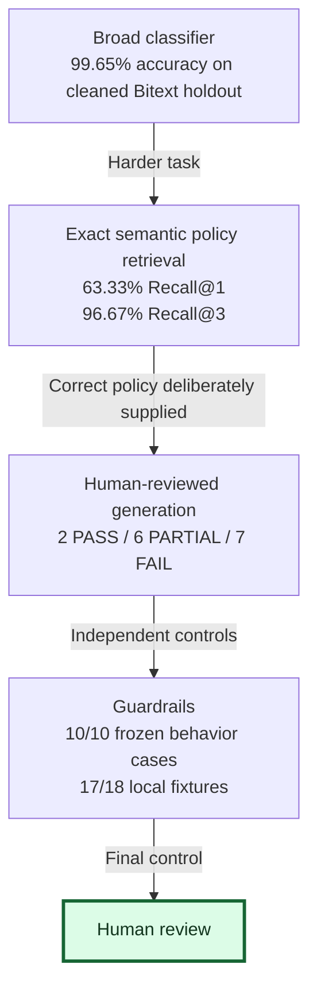

# TicketTriage

An academic AI prototype that helps an e-commerce support employee find verified policy guidance and prepare a response for human review.

## Why this project exists

Tier-1 support employees interpret varied wording and distinguish similar policies. Recognizing “payment” is easier than deciding whether a request concerns a pending authorization, duplicate capture or overdue approved refund.

## What the system does

TicketTriage is a **fixed human-reviewed workflow**, not an agent. It combines classification, policy retrieval, structured extraction, grounded drafting and deterministic checks. It cannot send messages, execute transactions or change accounts. Saved replay shows evaluated outputs; new local tickets do not generate GPT responses.

## Architecture



Amber = classifier hint; blue = evidence discovery; green = policy/human control points. This is the conceptual workflow: the offline MVP replays saved extraction/drafts, privacy/scope checks are limited, and the final human action occurs outside the app.

Classifier, retriever and LLM are not policy authorities. **Verified policy + human reviewer are the control points.** [Architecture](docs/architecture.md)

## Why multiple AI approaches?

- Narrow ML provides a broad category hint.
- Semantic retrieval discovers candidate evidence; classification never filters it.
- A foundation model structures facts and drafts against a supplied policy.
- Deterministic rules check evidence and control decisions.
- Human review retains final policy and response authority.

## Data

The public, synthetic [Bitext support dataset](https://huggingface.co/datasets/bitext/Bitext-customer-support-llm-chatbot-training-dataset) supports six-category classification, not policy truth. Duplicate/leakage-aware preprocessing produced 9,098 training and 2,275 held-out requests with zero normalized-text overlap; residual template/paraphrase similarity remains possible. Fifteen fictional DemoRetail policies form the retrieval corpus. Experience-inspired questions are generalized, with no intended confidential employer/customer records. [Provenance](docs/project_overview.md)

## Evaluation design

| Layer | Separate test |
|---|---|
| Classifier | Cleaned held-out Bitext requests |
| Retrieval | Frozen 60 queries; 15 personal/experience-inspired queries reported separately |
| Foundation model | 15 fixed cases with **GOLD policy intentionally supplied**, then human adjudication |
| Guardrails | Ten frozen behavior cases, local fixtures and saved-output replay |

Gold-card conditioning separates extraction/drafting weaknesses from retrieval mistakes. These tests have different targets: **there is no combined overall accuracy.** [Evaluation explainer](docs/evaluation.md)

## Evaluation journey



**Different tests, not one end-to-end accuracy metric.** The arrows explain the evaluation journey, not a shared test population or cascading success rate. Generation used the gold policy deliberately, not the retriever's output; guardrail scores measure separate finite checks, not production safety.

## Metrics

Classifier: majority baseline **22.64%** accuracy; TF-IDF + Logistic Regression **99.65%**, macro F1 **0.995978**. These measure a cleaned synthetic holdout, **not expected real-world accuracy**.

| Retrieval | Recall@1 | Recall@3 |
|---|---:|---:|
| TF-IDF | 58.33% | 83.33% |
| Semantic MiniLM | 63.33% | 96.67% |

Semantic MRR: **0.7821**. The predeclared **+10 percentage-point** Recall@1 target was **not met**; improvement was **+5 points**. Both methods achieved 11/15 personal-query Recall@1. High Recall@3 supports showing candidates, not silently trusting top-1.

**Final human review — Abin, 2 October 2026:**

| Component | PASS | PARTIAL | FAIL | AMBIGUOUS |
|---|---:|---:|---:|---:|
| Extraction | 4 | 11 | 0 | — |
| Generation | 2 | 6 | 7 | — |
| Escalation | 9 | — | 5 | 1 |

One unsupported prerequisite occurred in **C41**. Schema-valid output and mostly preserved facts did not guarantee complete guidance or correct escalation.

Guardrails v1.0 matched **10/10** expected primary behaviors; local fixtures passed **17/18**; replay detected all **five** known missed escalation controls. This is deterministic coverage on a small known benchmark, **not proof of end-to-end LLM safety/generalization**.

## Economics

Measured FM variable cost: **US$0.00064629/ticket**. Sequential HTTP latency: median **4.613 s**, p95 **6.093 s**. Illustrative cost-to-serve: low review **$0.40264629**, moderate **$2.11064629**, high **$6.63064629** per ticket. These combine measured token cost with assumed review/runtime/escalation inputs; they are **not measured savings**. [Scenarios](docs/cost_to_serve.md)

## Governance

Public/generalized data, fictional policies, minimal safe information, ignored credentials, policy IDs/versions/owners/review dates, frozen benchmarks, human adjudication and preserved failures support auditability. Human review is mandatory; business actions are never automated. Synthetic data does **not** establish compliance or production safety. [Governance](docs/governance_and_privacy.md)

## Limitations

Synthetic-data generalization; no true classifier OOD class; state/temporal retrieval errors; only 15 human-reviewed FM cases; finite guardrails with one preserved novel-domain failure; incomplete PII/OOD detection; no production traffic or measured handling-time savings. Offline mode does not generate new GPT drafts. The UI scope heuristic is not a validated OOD detector.

## Run locally

Tested with Python 3.14 on Windows. From this repository folder:

```powershell
python -m venv .venv
.\.venv\Scripts\python.exe -m pip install -r requirements.txt
.\.venv\Scripts\python.exe -m streamlit run app.py
```

Open **http://127.0.0.1:8502**. If you already created an environment in this release folder, use only the last command. Saved replay works offline after installation, without a key. New-ticket semantic preview also needs `requirements-local.txt` and pinned local MiniLM weights. **Weights are not bundled or automatically downloaded.** [Setup](docs/streamlit_demo_guide.md)

## Demo examples

**P13** useful draft; **P04** confusable cancellation retrieval; **C05** security escalation; **C36** missed escalation; **A03** missing dispatch state; **A01** unsupported discount. A03/A01 have input-rule evidence only, not GPT drafts.

## Repository structure

`app.py` presents the workflow; `src/` holds offline adapters, prompt/schema builders and frozen guardrails; `data/` holds policies, benchmarks and replay evidence; `results/` holds final layer-specific evidence; `docs/` explains the project; `assets/` illustrates it. Development diaries, raw API logs, confidential sources and caches are excluded. [Evidence inventory](docs/evidence_inventory.md)

## Course concepts demonstrated

| Class | TicketTriage design choice |
|---|---|
| 1 — Choose and test AI techniques | Narrow classification supplies a hint; a foundation model extracts/drafts. Measured baselines and human evaluation test capability rather than assume it. |
| 2 — AI system stack and RAG | Retrieval discovers authored policy evidence in a RAG workflow; versioned data, governance and a human reviewer connect the layers. |
| 3 — Foundation-model practice | Fixed prompts, token/context limits, strict structured output and separate evaluations expose quality, cost and latency tradeoffs. |
| 4 — Workflow versus agent | A fixed sequence with explicit policy selection has no autonomous planning, tool execution or business actions. |
| 5 — Business and operating model | Cost-to-serve scenarios include human-review labor, runtime and escalation; business value remains a hypothesis, not a measured savings claim. |
| 6 — Failures and oversight | Preserved failures, policy versions/review dates, guardrails and mandatory human review support governance; monitoring/regression and policy-update procedures are documented, not claimed as production-proven. |

## Future work

Broader real-world-like evaluation; state-aware retrieval/reranking; stronger privacy controls; a new separately evaluated guardrail version; optional governed live LLM mode. Agent tools would be a future governed extension, not part of this project.

[Third-party notices](THIRD_PARTY_NOTICES.md) · No production-readiness claim.

## License and publication layout

Original project code is licensed under [MIT](LICENSE); see [third-party notices](THIRD_PARTY_NOTICES.md) for upstream data, models, dependencies and generated evidence. Publish the **contents** of the release folder as the GitHub repository root: `app.py`, `README.md` and `LICENSE` belong at the top level, not inside a nested `public_release/` directory.
