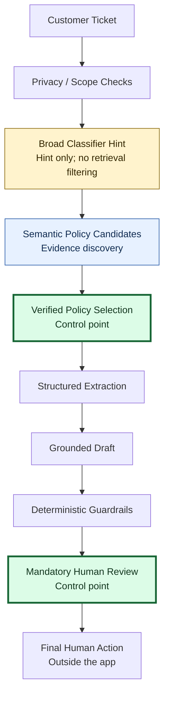
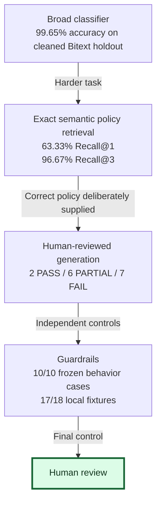

# TicketTriage

[Try the live portfolio demo](https://tickettriage.streamlit.app/)

An academic AI prototype for **Raj, a Tier-1 e-commerce support employee**, who needs to interpret unfamiliar tickets, find applicable policy guidance and review a response. Raj is a fictional Tier-1 support persona used for this academic prototype; no user study with Raj or real support employees was conducted.

**Demo mode:** saved GPT extraction/draft examples are replayed offline. New tickets can run local classification and semantic retrieval when the dependencies and pinned model cache are available. They do not produce a fresh GPT draft: **no live API mode is implemented**. Opening the app needs no key and makes no API calls.

## Why this project exists

Tier-1 support employees interpret varied wording and distinguish similar policies. Recognizing “payment” is easier than deciding whether a request concerns a pending authorization, duplicate capture or overdue approved refund.

## What the system does

TicketTriage is a **fixed human-reviewed workflow**, not an agent. It combines classification, policy retrieval, structured extraction, grounded drafting and deterministic checks. It cannot send messages, execute transactions or change accounts. Saved replay shows evaluated outputs; new local tickets do not generate GPT responses.

## Architecture



Amber = classifier hint; blue = evidence discovery; green = policy/human control points. This is the conceptual workflow: the offline MVP replays saved extraction/drafts, privacy/scope checks are limited, and the final human action occurs outside the app.

Classifier, retriever and LLM are not policy authorities. **Verified policy + human reviewer are the control points.** [Architecture](docs/architecture.md)

## Why multiple AI approaches?

- **Classifier:** a fast broad topic hint, not policy authority; it never restricts retrieval. No ablation proves its end-to-end necessity.
- **Retriever:** ranks all 15 cards for evidence discovery. Exact policy selection is a separate, harder problem than broad classification.
- **LLM:** extracts facts and drafts against supplied policy; it is not policy authority.
- **Guardrails:** deterministic regression/coverage controls, not evidence of general safety.
- **Human:** confirms the selected policy and reviews the final output; business actions remain outside the app.

## Data

The public, synthetic [Bitext support dataset](https://huggingface.co/datasets/bitext/Bitext-customer-support-llm-chatbot-training-dataset) supports six-category classification, not policy truth. Duplicate/leakage-aware preprocessing produced 9,098 training and 2,275 held-out requests with zero normalized-text overlap; residual template/paraphrase similarity remains possible. Fifteen fictional DemoRetail policies form the retrieval corpus. Experience-inspired questions are generalized, with no intended confidential employer/customer records. [Provenance](docs/project_overview.md)

The 45 controlled retrieval queries were assistant-authored under the approved policy taxonomy; the corpus and controlled queries share assistant authorship. The 15 personal queries were supplied from user experience-inspired wording, with disclosed assistant-assisted adaptation/review. These policy-aware questions are **not an independent blinded customer sample**. The 15 short fictional cards also do not establish retrieval performance on a large, changing operational knowledge base.

## Evaluation design

| Layer | Separate test |
|---|---|
| Classifier | Cleaned held-out Bitext requests |
| Retrieval | Frozen 60 queries; 15 personal/experience-inspired queries reported separately |
| Foundation model | 15 fixed cases with **GOLD policy intentionally supplied**, then human adjudication |
| Guardrails | Ten frozen behavior cases, local fixtures and saved-output replay |

Gold-card conditioning separates extraction/drafting weaknesses from retrieval mistakes. These tests have different targets: **there is no combined overall accuracy.** [Evaluation explainer](docs/evaluation.md)

## Evaluation journey



**Different tests, not one end-to-end accuracy metric.** The arrows explain the evaluation journey, not a shared test population or cascading success rate. Generation used the gold policy deliberately, not the retriever's output; guardrail scores measure separate finite checks, not production safety.

## Metrics

Classifier: majority baseline **22.64%** accuracy; TF-IDF + Logistic Regression **99.65%**, macro F1 **0.995978**. The 99.65% measures **cleaned Bitext six-category classification only**, not overall system accuracy or expected real-world performance.

| Retrieval | Recall@1 | Recall@3 |
|---|---:|---:|
| TF-IDF | 58.33% | 83.33% |
| Semantic MiniLM | 63.33% | 96.67% |

Semantic MRR: **0.7821**. Top-1 was **35/60 for TF-IDF versus 38/60 for semantic**, a nominal **+5 percentage-point** improvement, not conclusive superiority. The **+10-point target** was selected after observing the aggregate TF-IDF baseline and before semantic scoring; it required 41/60 and was **not met**. Both methods achieved 11/15 personal-query Recall@1. Recall@3 is the stronger operational signal for a candidate-review UI, but the benefit and friction of human selection have not been measured.

**Final human review — Abin, 2 October 2026:**

| Component | PASS | PARTIAL | FAIL | AMBIGUOUS |
|---|---:|---:|---:|---:|
| Extraction | 4 | 11 | 0 | — |
| Generation | 2 | 6 | 7 | — |
| Escalation | 9 | — | 5 | 1 |

These are **15 gold-policy-conditioned cases**, reviewed by one human who is also the project author. Provisional assistant ratings were visible beforehand, creating anchoring risk. The results should not be extrapolated to production prevalence. [Rubric and adjudication limits](docs/fm_human_review_rubric.md)

One unsupported prerequisite occurred in **C41**. Schema-valid output and mostly preserved facts did not guarantee complete guidance or correct escalation.

Earlier known failures informed Guardrails v1.0. It matched **10/10** declared frozen behavior cases; development fixtures passed **17/18**; replay detected all **five** known missed escalation controls. The preserved airline-request fixture failure demonstrates an out-of-domain gap. These are deterministic coverage/regression results, **not proof of general or end-to-end safety**.

## Economics

Measured FM variable cost: **US$0.00064629/ticket**. Sequential HTTP latency: median **4.613 s**, p95 **6.093 s**. Illustrative cost-to-serve: low review **$0.40264629**, moderate **$2.11064629**, high **$6.63064629** per ticket. These combine measured token cost with assumed review/runtime/escalation inputs; they are **not measured savings**. [Measured values versus assumptions](docs/economics_interpretation.md) · [Frozen scenarios](docs/cost_to_serve.md)

## Governance

Public/generalized data, fictional policies, minimal safe information, ignored credentials, policy IDs/versions/owners/review dates, frozen benchmarks, human adjudication and preserved failures support auditability. Policy ownership/approval metadata belongs to fictional DemoRetail, not a real organization. Human review is mandatory; business actions are never automated. Monitoring is a documented future operating need, not persistent production telemetry. Synthetic data does **not** establish compliance or production safety. [Governance](docs/governance_and_privacy.md)

## Limitations

Synthetic-data generalization; no true classifier OOD class; state/temporal retrieval errors; only 15 human-reviewed FM cases; finite guardrails with one preserved novel-domain failure; incomplete PII/OOD detection; no production traffic or measured handling-time savings. Offline mode does not generate new GPT drafts. The UI scope heuristic is not a validated OOD detector.

## Live demo

**Streamlit URL:** [tickettriage.streamlit.app](https://tickettriage.streamlit.app/)

Portfolio context: This project demonstrates evaluation-driven AI system design, RAG/retrieval, foundation-model evaluation, deterministic guardrails, governance and cost analysis.

The public profile supports all six saved examples, recorded classifier/ranking evidence, explicit verified-policy selection, saved extraction/drafts, guardrail diagnostics and final human-review notes. P13/P04/C05/C36 have GPT evidence; A03/A01 are behavior-only. New fictional tickets receive server-local classification and deterministic input checks. **New-ticket semantic retrieval is unavailable in the lightweight cloud profile** because optional MiniLM dependencies/weights are excluded. Saved semantic candidates remain visible. No live GPT generation, customer sending or business actions exist.

Deploy the repository's `app.py` with **Python 3.13** and root `requirements.txt`; leave secrets empty. The source is [abinkrishnak/TicketTriage](https://github.com/abinkrishnak/TicketTriage). [Deployment audit and setup](docs/community_cloud_deployment.md)

## Run locally

Deployment dependencies resolve for Linux/Python 3.13; local smoke tests use Python 3.14 on Windows. A Community Cloud runtime test is still required after deployment. From this repository folder:

```powershell
python -m venv .venv
.\.venv\Scripts\python.exe -m pip install -r requirements.txt
.\.venv\Scripts\python.exe -m streamlit run app.py
```

Open the local URL printed by Streamlit (normally **http://localhost:8501**). If you already created an environment for this repository, use only the last command. Saved replay works offline after installation, without a key. New-ticket semantic preview also needs `requirements-local.txt` and pinned local MiniLM weights. **Weights are not bundled or automatically downloaded.** [Setup](docs/streamlit_demo_guide.md)

The clone contains saved evidence and the small classifier, not installed packages or large MiniLM weights. After installing `requirements.txt`, saved replay works offline. Optional new-ticket semantic preview needs `requirements-local.txt` and the verified local model cache. Fresh GPT drafting would require a separately implemented, approved live mode, provider access and a key; adding a key alone does not enable it. This repository supports replay and evidence inspection, not complete retraining from bundled raw data.

## Demo examples

**Case IDs:** P = personal / experience-inspired; C = controlled benchmark; A = ambiguous / unsupported behavior case.

**P13** useful draft; **P04** confusable cancellation retrieval; **C05** security escalation; **C36** missed escalation; **A03** missing dispatch state; **A01** unsupported discount. A03/A01 have input-rule evidence only, not GPT drafts.

## Repository structure

`app.py` presents the workflow; `src/` holds offline adapters, prompt/schema builders and frozen guardrails; `data/` holds policies, benchmarks and replay evidence; `results/` holds final layer-specific evidence; `docs/` explains the project; `assets/` illustrates it. Development diaries, raw API logs, confidential sources and caches are excluded. [Evidence inventory](docs/evidence_inventory.md)

## Course concepts demonstrated

| Class | TicketTriage design choice |
|---|---|
| 1 — Choose and test AI techniques | Narrow classification supplies a hint; a foundation model extracts/drafts. Measured baselines and human evaluation test capability rather than assume it. |
| 2 — AI system stack and RAG | Retrieval discovers authored policy evidence in a RAG workflow; versioned data, governance and a human reviewer connect the layers. |
| 3 — Foundation-model practice | Fixed prompts, token/context limits, strict structured output and separate evaluations expose quality, cost and latency tradeoffs. |
| 4 — Workflow versus agent | Steps are known in advance; the model chooses no arbitrary tool sequence; no CRM/refund/cancel/write action or autonomous external-feedback loop exists. [Workflow boundary](docs/architecture.md#why-this-is-a-workflow-not-an-agent) |
| 5 — Business and operating model | Cost-to-serve scenarios include human-review labor, runtime and escalation; business value remains a hypothesis, not a measured savings claim. |
| 6 — Failures and oversight | Preserved failures, policy versions/review dates, guardrails and mandatory human review support governance; monitoring/regression and policy-update procedures are documented, not claimed as production-proven. |

## Evidence and design decisions

[Examiner response matrix](docs/examiner_risk_response.md) · [Plan versus delivered](docs/plan_vs_delivered.md) · [Safe report claims](docs/report_safe_claims.md) · [Product evaluation still needed](docs/evaluation.md#not-yet-evaluated-end-to-end)

## Future work

Broader real-world-like evaluation; state-aware retrieval/reranking; stronger privacy controls; a new separately evaluated guardrail version; optional governed live LLM mode. Agent tools would be a future governed extension, not part of this project.

[Third-party notices](THIRD_PARTY_NOTICES.md) · No production-readiness claim.

## License

Original project code is licensed under [MIT](LICENSE); see [third-party notices](THIRD_PARTY_NOTICES.md) for upstream data, models, dependencies and generated evidence.
