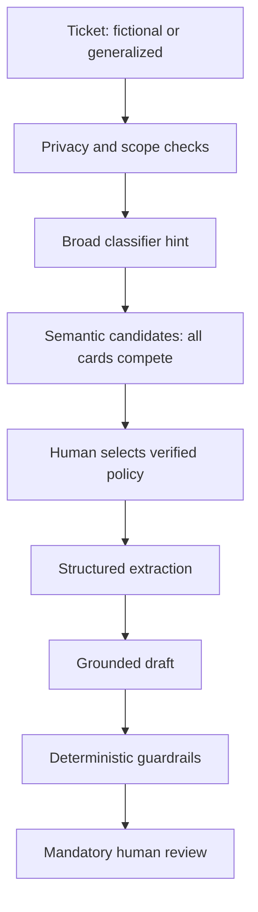

# Architecture and control points

The classifier never filters retrieval. The retriever discovers evidence; top-1 is not a policy decision. The LLM structures reported facts and drafts from a supplied card; it does not decide policy truth. Verified policy and human review are the control points. Business escalation is distinct from mandatory draft review.

Saved replay uses recorded candidates and exact parsed FM outputs under their original supplied card. Explicit selection gates display, not new generation. Local preview performs classification, semantic retrieval and input checks only; no new extraction/draft exists. No agent loop, transaction tool or messaging capability is present. A finite UI topic heuristic hides misleading recommendations for non-support text but is not a validated OOD detector or a changed guardrail version.

## Why this is a workflow, not an agent

TicketTriage's steps are known in advance. The model does not dynamically choose an arbitrary sequence of tools. No CRM, refund, cancellation or other external write action exists. External systems do not return step-by-step ground truth inside an autonomous act-observe-replan loop. Policy selection and final response authority remain with a human. Using an LLM or calling a fixed inference endpoint does not itself establish agency.

A future agentic version could make bounded choices among authorized information tools, but would require scoped tool permissions, step/budget caps, trusted external ground truth, explicit approval gates for consequential actions, evaluation of negative cases (wrong policy, missing state, rejected authorization and tool failure), and rollback/auditability. Where an action cannot be reversed, prevention and human approval must replace any promise of rollback. None of these future agent capabilities has been implemented or evaluated here.
