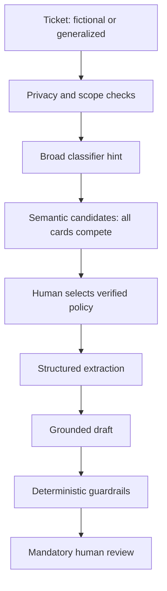

# Architecture and control points

The classifier never filters retrieval. The retriever discovers evidence; top-1 is not a policy decision. The LLM structures reported facts and drafts from a supplied card; it does not decide policy truth. Verified policy and human review are the control points. Business escalation is distinct from mandatory draft review.

Saved replay uses recorded candidates and exact parsed FM outputs under their original supplied card. Explicit selection gates display, not new generation. Local preview performs classification, semantic retrieval and input checks only; no new extraction/draft exists. No agent loop, transaction tool or messaging capability is present. A finite UI topic heuristic hides misleading recommendations for non-support text but is not a validated OOD detector or a changed guardrail version.
